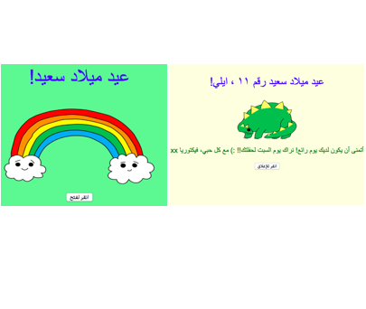

## المقدمة

في هذا المشروع ، سيتم تعريفك بـ HTML و CSS من خلال تعلم كيفية إنشاء بطاقة عيد ميلاد الخاصة بك.

### ما الذي ستصنعه

انقر الزر لفتح بطاقة عيد الميلاد:

  <iframe src="https://trinket.io/embed/html/c052cb54e1?outputOnly=true&start=result" width="600" height="450" frameborder="0" marginwidth="0" marginheight="0" allowfullscreen>
  </iframe>
  

### ما الذي ستتعلمه

يتناول هذا المشروع عناصر من معايير المناهج الرقمية الخاصة بـ [Raspberry Pi](http://rpf.io/curriculum){:target="_blank"}:

+ [تصميم الأصول الأساسية ثنائية الأبعاد وثلاثية الأبعاد](https://www.raspberrypi.org/curriculum/design/creator){:target="_blank"}.

### معلومات إضافية للمعلمين

إذا كنت بحاجة إلى طباعة هذا المشروع، فالرجاء استخدام [نسخة متوافقة مع الطابعة](https://projects.raspberrypi.org/ar-SA/projects/happy-birthday/print){:target="_blank"}.

استخدم الرابط الموجود بتذييل الصفحة للوصول إلى مستودع GitHub الخاص بهذا المشروع، والذي يضم كل المصادر (بما في ذلك مثال لنموذج مكتمل) في مجلد ‘ar-SA/resources’.