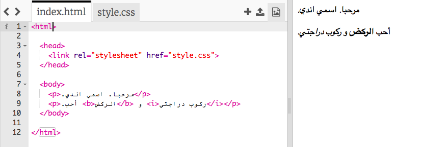
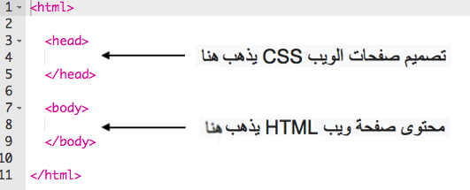
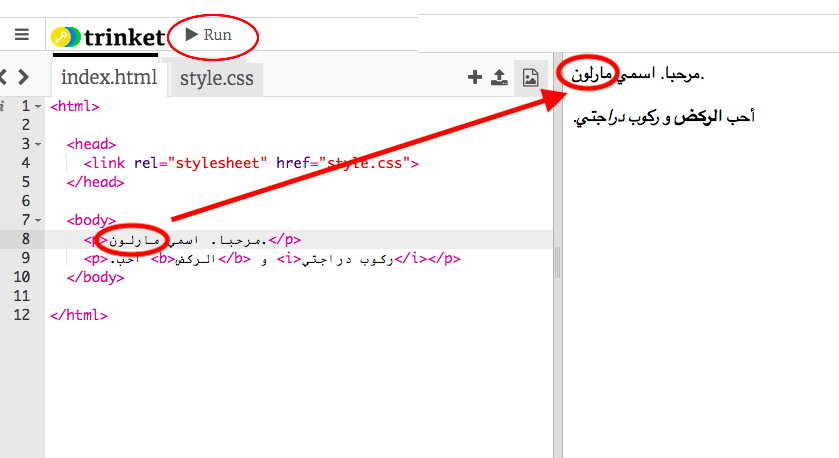
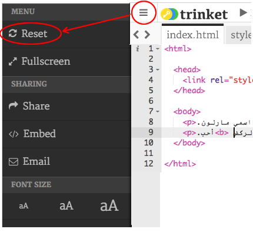
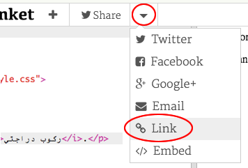
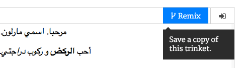

## ما المقصود بـ HTML؟

HTML تعني **Hypertext Markup Language** ، اللغة المستخدمة في إنشاء صفحات الويب. دعونا نلقي نظرة على مثال!

ستستخدم موقع ويب يسمى trinket.io لكتابة تعليمات HTML البرمجية.

+ افتح [هذا الـ trinket](http://jumpto.cc/web-intro){:target="_blank"}.

سيكون المشروع بالشكل التالي:



لغة البرمجة (الكود) الذي يمكنك رؤيته على اليسار هو HTML. على يمين trinket، يمكنك رؤية صفحة الويب التي قام بها كود HTML.

يستخدم HTML **علامات tags** لبناء صفحات الويب. ابحث عنهم في هذا الكود HTML في السطر ٨ من الكود:

```html
<p>مرحبا. اسمي اندي.</p>
```

`<p>` هي مثال لعلامة ، وهي اختصار ** للفقرة ( paragraph)**. يمكنك بدء فقرة بـ `<p>` ، وإنهاء فقرة بـ ` </p>`.

+ هل يمكنك العثور على أي علامات (tags) أخرى؟

## \--- collapse \---

## title: الإجابة

والعلامة ألاخرى التي قد تكون وجدتها هي `<b>` ،والتي تعني **غامق**:

```html
<b>تشغيل</b>
```

إليك بعض الأفكار:

+ `<html>` و `</html>` تشير إلى بداية ونهاية وثيقة HTML
+ `<head>` و `</head>` المكان الذي يتم كتابة أشياء مثل CSS (سنصل إليها لاحقًا)
+ `<body>` و `</body>` مكان حيث تكتب محتوى موقع الويب الخاص بك



\--- /collapse \---

+ قم بإجراء تغيير على أحد فقرات النص في ملف HTML (على اليسار). انقر **Run** و سترى تغيير صفحة الويب الخاصة بك (على اليمين)!



+ إذا ارتكبت خطأ وتريد التراجع عن جميع تغييراتك ، فيمكنك النقر فوق زر **menu** ثم انقر فوق **Reset**.



للتراجع عن آخر شيء قمت به ، يمكنك الضغط على مفاتيح ` Ctrl ` و `z` معا.

### لا تحتاج إلى حساب Trinket لحفظ مشاريعك!

إذا لم يكن لديك حساب Trinket ، فانقر السهم** للأسفل ** ثم انقر فوق ** Link**. سيعطيك هذا رابطًا يمكنك حفظه والعودة إليه لاحقًا. ستحتاج إلى القيام بذلك في كل مرة تقوم فيها بإجراء تغييرات، حيث سيتغير الرابط!



إذا كان لديك حساب Trinket ، فإن أسهل طريقة لحفظ صفحة الويب الخاصة بك هي النقر فوق زر **Remix** في الجزء العلوي من trinket. سيؤدي هذا إلى حفظ نسخة من trinket في ملفك الشخصي.

