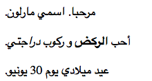

--- challenge ---

## التحدي: إضافة فقرة أخرى

- هل يمكنك إضافة فقرة ثالثة من النص إلى صفحة الويب الخاصة بك ، أسفل الفقرتين الأخريين؟

تذكر أن فقرة جديدة يجب أن تبدأ بعلامة `
`، وتنتهي بعلامة `
`.

اليك كيف يمكن أن يكون شكل موقع الويب الخاص بك:

هل يمكنك إضافة نص بخط **عريض** و <u>أسفله سطر</u> إلى الفقرة الجديدة؟ إستخدم علامات `<u>` و `</u>` لوضع خط أسفل النص.

--- /challenge ---