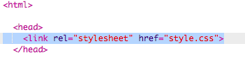
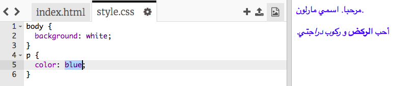

## ما المقصود بـ CSS؟

CSS stands for **Cascading Style Sheets**, and it is a language used to style webpages and make them look nice.

+ This code links your webpage to a CSS file — see if you can find it in the `<head>` of the HTML document:



CSS lists all of the **properties** for a particular tag.

+ Click on the `style.css` tab to see the CSS code for your webpage.
    
    

+ Find this code:

```html
p {
    color: black;
}
```

This CSS code determines a property for paragraphs (`p`), which says that the text colour should be black. Notice the American spelling: 'color'.

+ Change the word 'black' in the CSS code to 'blue'. You should see the text colour of all paragraphs change to blue.

