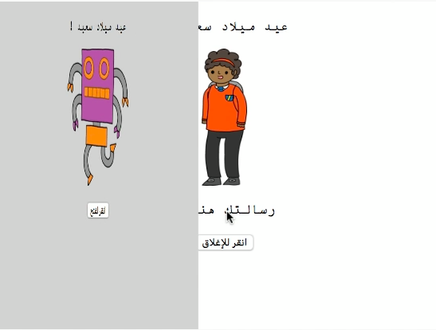
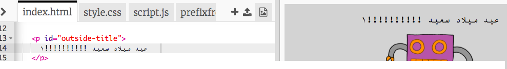
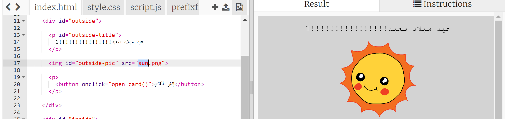
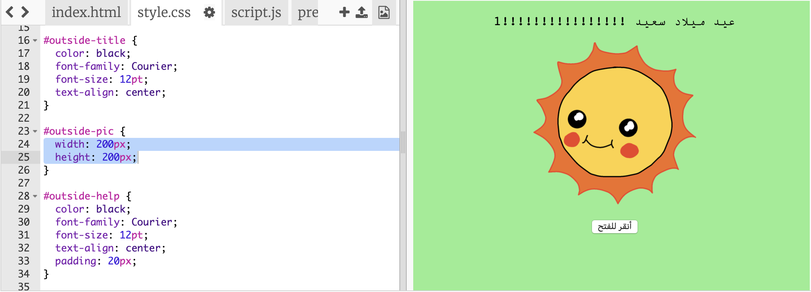
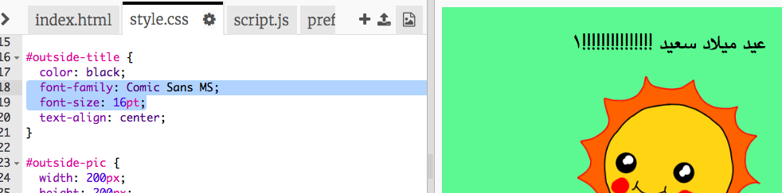

## تصميم بطاقة عيد ميلاد

دعونا نستخدم ما تعلمته حول HTML و CSS لإنشاء بطاقة عيد ميلاد مخصصة.

+ افتح [هذا الـ trinket](https://trinket.io/html/bb6d8905b8){:target="_blank"}.

لقد كتبنا الكثير من التعليمات البرمجية للبدء، لكن بطاقة عيد الميلاد تبدو مملة جدًا حتى الآن ، لذلك ستجري بعض التغييرات على النص البرمجي HTML و CSS.

+ انقر فوق الزر الموجود في مقدمة البطاقة، وستراها تُفتح للكشف عن الداخل.

+ انتقل إلى السطر 14 من النص البرمجي HTML. حاول تغيير النص لتخصيص بطاقتك.

+ هل يمكنك العثور على النص البرمجي HTML لصورة الروبوت، وتغيير كلمة `robot` إلى `sun` ؟

--- hints ---
 --- hint ---

+ انظر على السطر 17 للعثور على النص البرمجي.
+ قم بتغيير `robot` إلى `sun` و سترى الصورة تتغير!

--- /hint ------ /hints ---

يمكنك استخدام أي من الكلمات `boy`, `diamond`, `dinosaur`, `flowers`, `girl`, `rainbow`, `robot`, `spaceship`, `sun`, `tea`, or `trophy` for a birthday card, or `cracker`, `elf`, `penguin`, `present`, `reindeer`, `santa`, or `snowman` إذا كنت تفضل عمل بطاقة عيد الميلاد.

يمكنك أيضًا تعديل النص البرمجي CSS لبطاقة عيد الميلاد.

+ انقر فوق علامة التبويب `style.css`. الجزء الأول هو كل من أنماط CSS للشكل الخارجي **outside** من البطاقة.

+ قم بتغيير `background-color` إلى `lightgreen`.

+ يمكنك أيضًا تغيير حجم الصورة. اذهب الى `#outside-pic` في النص البرمجي لـCSS, و قم بتغيير `width` و `height` للصورة الخارجية الى `200px` (`إن px` تعني pixels).

+ يمكن تغيير الخط أيضا. اذهب الى `#outside-title` لـCSS و قم بتغيير `font-family` إلى `Comic Sans MS` و ال `font-size` to `16pt`.

يمكنك استخدام خطوط أخرى ، على سبيل المثال:

+ `Arial`
+ `Impact`
+ `Tahoma`