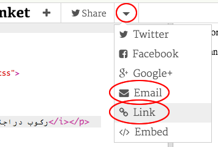

--- challenge ---

## التحدي: إنشاء بطاقة خاصة

+ استخدم كل ما تعلمته عن HTML و CSS لإنهاء إنشاء بطاقة مخصصة. ولا يجب أن تكون بطاقة عيد ميلاد، فقد تكون بطاقة أعياد السنة أو أي مناسبة أخرى!

إليك مثالاً:

يمكنك العثور على المزيد من أسماء ألوان CSS [هنا](http://jumpto.cc/colours){:target="_blank"}.

+ بمجرد الانتهاء من بطاقتك ، يمكنك مشاركتها أو إرسالها بالبريد الإلكتروني إلى شخص ما.

--- /challenge ---

***
تمت ترجمة هذا المشروع بواسطة متطوعين:

نادية علي قاسم

خالد علي

بفضل المتطوعين ، يمكننا إعطاء الناس في جميع أنحاء العالم فرصة للتعلم بلغتهم الخاصة. يمكنك مساعدتنا في الوصول إلى المزيد من الأشخاص من خلال التطوع للترجمة - مزيد من المعلومات على [rpf.io/translate](https://rpf.io/translate).