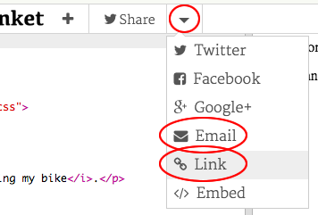

\--- challenge \---

## التحدي: إنشاء بطاقة خاصة

+ Use everything you've learnt about HTML and CSS to finish making a personalised card. And it doesn't have to be a birthday card, it could be one for Christmas or any other occasion!

إليك مثالًا:

You can find more CSS colour names [here](http://jumpto.cc/colours){:target="_blank"}.

+ Once you've finished your card, you can share or email it to someone.

\--- /challenge \---