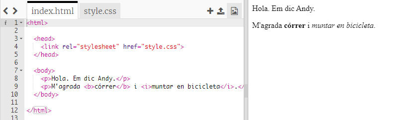
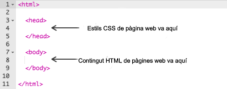
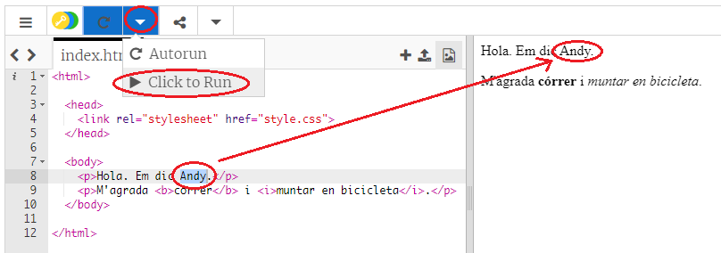
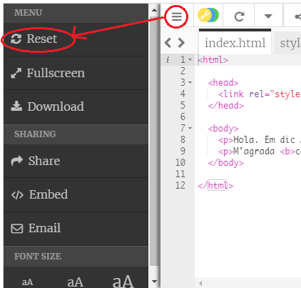
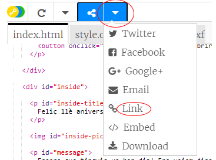
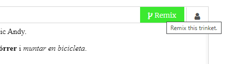

## Què és HTML?

HTML són les sigles de HiperText Markup Language i fa referència al **Llenguatge de marques d'hipertext**, l’idioma que s’utilitza per fer pàgines web. Mirem un exemple!<0>

Faràs servir un lloc web anomenat trinket.io per escriure codi HTML.

+ Obre [aquest Trinket](http://jumpto.cc/web-intro) {:target ="_ blank"}.

El projecte hauria de ser així:



El codi que pots veure a l’esquerra és HTML. A la dreta del trinket, pots veure la pàgina web que ha creat el codi HTML.

HTML utilitza **etiquetes** per crear pàgines web. Busca aquest codi HTML a la línia 8 del teu codi:

```html
<p>Hola. Em dic Andy.</p>
```

`<p>` és un exemple d'etiqueta i és la forma abreujada de **paràgraf**. Pots començar un paràgraf amb `<p>`, i acabar un paràgraf amb ` </p>`.

+ Pots detectar altres etiquetes?

## \--- collapse \---

## títol: Resposta

Una altra etiqueta que deus haver vist és `<b>`, que significa **negreta**:

```html
<b>córrer</b>
```

Aquí tens algunes més:

+ `<html>` i ` </html>` marca l’inici i el final del document HTML
+ `<head>` i ` </head>` és on van coses com CSS (arribarem a això més endavant)
+ `<body>` i ` </body>` és on va el contingut del teu lloc web



\--- /collapse \---

+ Fes un canvi a un dels paràgrafs de text del fitxer HTML (a l’esquerra). Fes clic a **Executa** i hauries de veure com canvia la teva pàgina web (a la dreta)!



+ Si has comès un error i vols desfer tots els canvis, pots fer clic al **menu** i després fes clic a **Reset** per restablir el codi.



Per desfer només l'últim que has fet, pot prémer les tecles `Ctrl` i `z` alhora.

### No necessites un compte a Trinket per guardar els teus projectes!

Si no tens un compte a Trinket, clica la **fletxa cap avall** i després clica **Link**. Així obtindràs un enllaç que pots guardar i utilitzar per accedir-hi en un altre moment. Caldrà repetir aquest procés cada vegada que facis canvis, ja que l'enllaç es modificarà!



Si tens un compte Trinket, la manera més senzilla de desar la teva pàgina web és fer clic al botó **Remix** a la part superior del trinket. D’aquesta manera, es guardarà una còpia del trinket al teu perfil.

