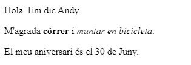

\--- challenge \---

## Repte: afegeix un altre paràgraf

- Pots afegir un tercer paràgraf de text a la teva pàgina web, per sota dels altres dos?

Recorda que el nou paràgraf hauria de començar amb una etiqueta `
` i ha de finalitzar amb l'etiqueta ` 
`.

A continuació es mostra com s'hauria de veure la teva pàgina web:

Pots afegir text en **negreta** i <u>subratllat</u> al teu nou paràgraf? Utilitza les etiquetes `<u>` i ` </u>` pel text subratllat.

\--- /challenge \---