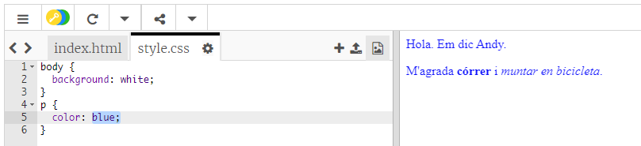

## Què és CSS?

CSS són les inicials de Cascading Style Sheets i fa referència a **Fulls d'estil en cascada** que és un llenguatge que es fa servir per dissenyar pàgines web i que es vegin bé.

+ Aquest codi enllaça la teva pàgina web amb un fitxer CSS: mira si el pots trobar al `<head>` del document HTML:


CSS llista totes les **propietats** per a una etiqueta determinada.

+ Fes clic a `style.css` per veure el codi CSS de la teva pàgina web.
    
    

+ Troba aquest codi:

```html
p {
    color: black;
}
```

Aquest codi CSS determina una propietat per als paràgrafs (`p`), que diu que el color del text ha de ser el negre.

+ Canvia la paraula "black" al codi CSS per "blue". Hauries de veure que el color del text de tots els paràgrafs canvia al color blau.

