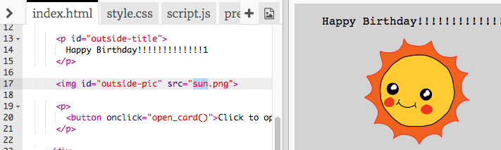

## Fent una targeta d’aniversari

Utilitzarem el que has après sobre HTML i CSS per elaborar la teva pròpia targeta d’aniversari personalitzada.

+ Obre [aquest Trinket](https://trinket.io/html/b33e4f4ca8){:target ="_ blank"}.

Hem escrit molt de codi per començar, però tot i així la targeta d’aniversari sembla massa avorrida, de manera que faràs alguns canvis al codi HTML i CSS.

+ Fes clic al botó de la part frontal de la targeta i l'hauries de veure que s'obre per revelar-ne l'interior.

+ Vés a la línia 14 del codi HTML. Prova d’editar el text per personalitzar la teva targeta.

+ Pots trobar el codi HTML de la imatge del robot i canviar la paraula `robot` a `sun`?

\--- hints \--- \--- hint \---

+ Mira a la línia 17 per trobar el codi.
+ Canvia la paraula `robot` per `sun` i veuràs que la imatge canvia!

\--- /hint \--- \--- /hints \---

Pots fer servir qualsevol de les paraules `boy`, `diamond`, `dinosaur`, `flowers`, `girl`, `rainbow`, `robot`, `spaceship`, `sun`, `tea`, o bé `trophy` per a una targeta d'aniversari, o `cracker`, `elf`, `penguin`, `present`, `reindeer`, `santa`, o `snowman` si prefereixes fer una felicitació de Nadal.

També pots editar el codi CSS de la targeta d’aniversari.

+ Fes clic a la pestanya `style.css`. La primera part són tots els estils CSS de **l'exterior** de la targeta.

+ Canvia el `background-color` a `lightgreen`.

+ També pots canviar la mida d’una imatge. Vés al codi CSS `#outside-pic` i canvia l'amplada `width` i l'alçada `height` de la imatge exterior a `200px` (`px` significa píxels).

+ El tipus de lletra també es pot canviar. Vés al CSS `#outside-title` i canvia `font-family` a `Comic Sans MS` i la mida de lletra `font-size` a `16pt`.

Pots utilitzar altres tipus de lletra, per exemple:

+ `arial`
+ `Impact`
+ `Tahoma`