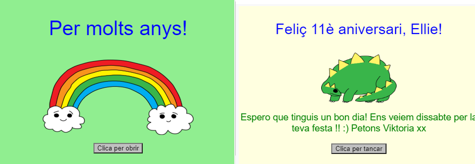
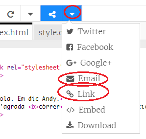

\--- challenge \---

## Repte: crea una targeta personalitzada

+ Utilitza tot el que has après sobre HTML i CSS per acabar de fer una targeta personalitzada. I no ha de ser una targeta d'aniversari, pot ser una per a Nadal o qualsevol altra ocasió!

Aquí tens un exemple:

Troba més noms de color CSS [aquí](http://jumpto.cc/colours) {:target="_ blank"}.

+ Un cop hagis acabat la targeta, pots compartir-la o enviar-la per correu electrònic a qui vulguis.

\--- /challenge \---