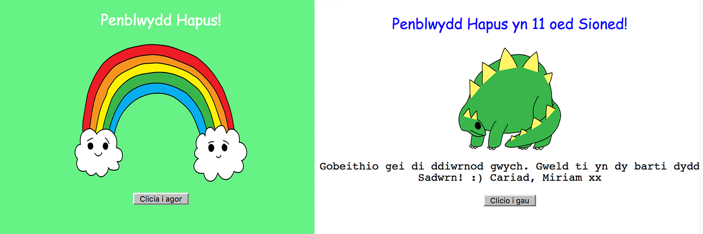

## Cyflwyniad

Yn y prosiect yma fe fyddi di'n cael dy gyflwyno i HTML a CSS trwy ddysgu sut i greu carden pen-blwydd.

### Beth fyddi di'n ei wneud

Clicia'r botwm i agor y garden pen-blwydd:

  <iframe src="https://trinket.io/embed/html332900c89b?outputOnly=true&start=result" width="600" height="450" frameborder="0" marginwidth="0" marginheight="0" allowfullscreen>
  </iframe>
  

### Beth fyddi di'n ei ddysgu

Mae'r prosiect yma yn trin elfennau sydd yn rhan o'r adran ganlynol o [Faes Llafur Creu Digidol Raspberry Pi](http://rpf.io/curriculum){:target="_blank"}:

+ [Dylunio elfennau sylfaenol yn 2D a 3D](https://www.raspberrypi.org/curriculum/design/creator){:target="_blank"}.

### Gwybodaeth ychwanegol i addysgwyr

Os oes angen i chi argraffu'r prosiect yma, defnyddiwch y [fersiwn sy'n addas i'w argraffu](https://projects.raspberrypi.org/cy-GB/projects/happy-birthday/print){:target="_blank"} .

Defnyddiwch y ddolen ar waelod y dudalen i gael mynediad i GitHub y prosiect, sydd yn cynnwys yr holl adnoddau (yn cynnwys enghraifft o brosiect gorffenedig) yn y ffolder 'cy-GB/resources'.

