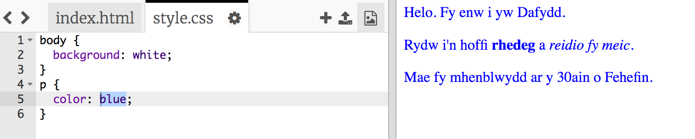

## Beth yw CSS?

Mae CSS yn golygu **Cascading Style Sheets** sy'n iaith sy'n cael ei ddefnyddio i roi steil i dudalennau gwe a gwneud iddynt edrych yn neis.

+ Mae'r côd yma yn cysylltu dy dudalen gwe gyda ffeil CSS - edrycha i weld os alli di ddod o hyd iddo yn `<head>` y ddogfen HTML:


Mae CSS yn rhestri yr holl **nodweddion** ar gyfer tag penodol.

+ Clicia y tab `style.css` i weld y côd CSS ar gyfer dy dudalen gwe.

	

+ Tyrd o hyd i'r côd yma:

```html
p {
	color: black;
}
```

Mae'r côd CSS yma yn penderfynu'r nodwedd ar gyfer y paragraffau (`p`) sydd yn dweud y ddylai'r testun fod yn lliw du. Sylwa bod angen defnyddio sillafiad Saesneg Americanaidd ar gyfer 'color'.

+ Newida'r gair 'black' yn y côd CSS i 'blue'. Fe ddylai lliw testun yr holl baragraffau newid i las.


