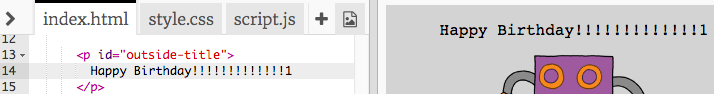

## Gwneud carden pen-blwydd

Fe wnawn ni ddefnyddio'r hyn rwyt ti wedi ei ddysgu am HTML a CSS i wneud carden pen-blwydd unigryw.

+ Agora'r [trinket yma](https://trinket.io/html/e6752260f5){:target="_blank"}.

Rydym wedi ysgrifennu llawer o gôd i fod o gymorth wrth ddechrau, ond mae'r garden pen-blwydd yn edrych braidd yn ddiflas ar hyn o bryd felly bydd angen gwneud newidiadau i'r côd HTML a CSS.

+ Clicia'r botwm ar flaen y garden ac fe ddyli ei weld yn agor i ddangos beth sydd tu fewn.

+ Cer i linell 14 y côd HTML. Ceisia olygu'r testun i bersonoleiddio dy garden.

+ Alli di newid y côd HTML ar gyfer llun y robot, a newid y gair `robot` i `sun`?

--- hints ---
--- hint ---
+ Edrycha ar linell 17 i ddod o hyd i'r côd
+ Newida'r gair `robot` i `sun`, ac fe fyddi di'n gweld y llun yn newid!

--- /hint ---
--- /hints ---

Alli di ddefnyddio unryw rai o'r geiriad yma `boy`, `diamond`, `dinosaur`, `flowers`, `girl`, `rainbow`, `robot`, `spaceship`, `sun`, `tea`, neu `trophy` ar gyfer carden penblwydd, neu `cracker`, `elf`, `penguin`, `present`, `reindeer`, `santa`, neu `snowman` os hoffet ti wneud carden Nadolig.

Fe alli di hefyd olygu côd CSS y garden pen-blwydd.

+ Clicia'r tab `style.css`. Mae'r rhan gyntaf i gyd yn steiliau CSS ar gyfer **tu allan** y garden.

+ Newida'r `background-color` i `lightgreen`.

+ Fe alli di hefyd newid maint y llun. Cer i `#outside-pic` yn y côd CSS, a newid y `width` a `height` o'r ddelwedd tu allan i `200px` (`px` yw picsel / pixels)

+ Mae modd newid y ffont hefyd. Cer i `#outside-title` yn y CSS a newid `font-family` i `Comic Sans MS` a `font-size` i `16pt`.

Mae modd defnyddio ffontiau arall, er enghraifft:
+ `arial`
+ `Impact`
+ `Tahoma`
