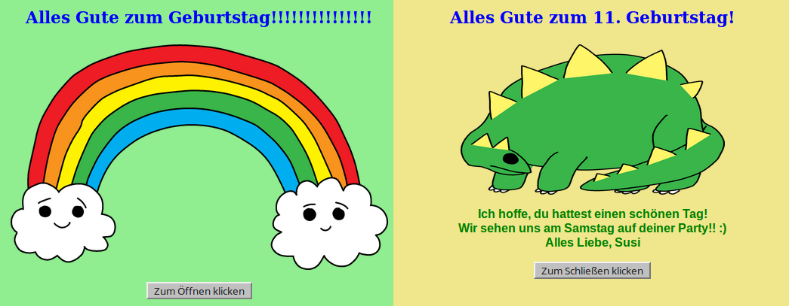

## Einleitung

In diesem Projekt lernst du HTML und CSS kennen, indem du lernst, wie du deine eigene Geburtstagskarte gestalten kannst.

### Was du machen wirst

Klicke auf die Schaltfläche, um die Geburtstagskarte zu öffnen:

  <iframe src="https://trinket.io/embed/html/e996dc0380?outputOnly=true&start=result" width="600" height="450" frameborder="0" marginwidth="0" marginheight="0" allowfullscreen>
  </iframe>
  

### Was du lernen wirst

Dieses Projekt umfasst Elemente aus den folgenden Themen des [ Raspberry Pi Digital Making Curriculum ](http://rpf.io/curriculum) {:Ziel="_leer"}:

+ [Entwurf von grundlegenden 2D- and 3D-Gütern](https://www.raspberrypi.org/curriculum/design/creator){:target="_blank"}.

### Zusätzliche Informationen für Pädagogen

Wenn Sie dieses Projekt ausdrucken müssen, verwenden Sie bitte die [druckerfreundliche Version](https://projects.raspberrypi.org/en/projects/happy-birthday/print){:target="_blank"} .

Verwenden Sie den Link in der Fußzeile, um auf das GitHub-Repo für dieses Projekt zuzugreifen. Dieses enthält alle Ressourcen (einschließlich eines Beispiels für ein abgeschlossenes Projekt) im Ordner "de/resources".