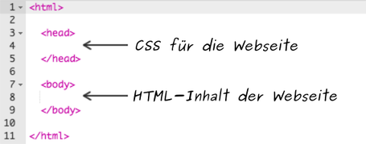
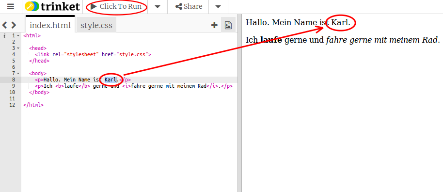
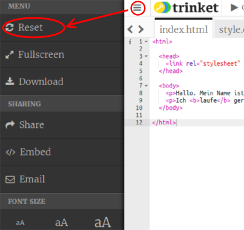
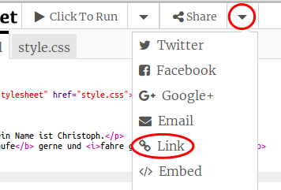

## Was ist HTML?

HTML steht für __HyperText Markup Language__, und ist die Sprache um Webseiten zu machen. Schauen wir uns ein Beispiel an!

+ Um HTML zu schreiben wirst du eine Website namens Trinket benutzen. Öffne dieses Trinket: <a href="http://jumpto.cc/web-intro" target="_blank">jumpto.cc/web-intro</a>. Wenn du das online liest, kannst du auch die eingebettete Version dieses Trinkets weiter unten benutzen.

<div class="trinket">
	<iframe src="https://trinket.io/embed/html/850a678202" width="100%" height="400" frameborder="0" marginwidth="0" marginheight="0" allowfullscreen>
	</iframe>
</div>

+ Der Code, den du auf der linken Seite des Trinket sehen kannst ist HTML. Auf der rechten Seite siehst du die Web-Seite, die der HTML-Code erzeugt hat.

	HTML verwendet __'tags'__ um Web-Seiten zu erzeugen. Siehst du das HTML in Zeile 8 deines Codes?

	```
	<p>Hi. My name is Andy.</p>
	```

	`<p>` ist ein Beispiel für einen 'tag', und es ist eine Abkürzung für __paragraph__ (das bedeutet Absatz). Du kannst einen Absatz mit `<p>` beginnen und mit `</p>` den Absatz beenden.

+ Findest du noch andere 'tags'? Ein anderer 'tag', den du gefunden haben könntest, ist `<b>` in Zeile 9 , das für __bold__ steht (Fettschrift):

	```
	<b>running</b>
	```

	Hier sind noch einige:

	+ `<html>` und `</html>` markieren den Start und das Ende des HTML-Dokuments;
	+ `<head>` und `</head>` ist der Platz für Dinge wie CSS (dazu kommen wir später!);
	+ `<body>` und `</body>` ist der Platz für den Inhalt deiner Web-Seite.

	

+ Ändere etwas in einem der Textabsätze in HTML (auf der linken Seite). Klicke 'Run' und du solltest die Änderung auf deiner Web-Seite sehen (auf der rechten Seite)!

	

+ Wenn du einen Fehler gemacht hast und alle deine Änderungen rückgängig machen willst, kannst du die Schaltfläche 'Menü' klicken und auf 'Reset' klicken. Probier es mal!

	

__Du brauchst kein Trinket-Konto um deine Projekte zu speichern!__ 

Wenn du kein Trinket-Konto hast, klicke den Pfeil nach unten und klicke dort auf 'Link'. Das zeigt dir einen Link, den du speichern kannst, und mit dem du später zurückkommen kannst. Das musst du jedes mal machen, wenn du Änderungen gemacht hast, da der Link sich dadurch ändert!



Wenn du ein Trinket-Konto hast, dann klicke einfach auf die Schaltfläche 'Remix' in der Kopfzeile des Trinket um deine Web-Seite zu speichern. Das speichert eine Kopie des Trinkets in deinem Profil.


