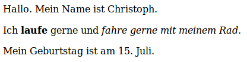

--- Herausforderung ---

## Aufgabe: Füge einen weiteren Absatz hinzu

- Kannst du deiner Webseite einen dritten Textabschnitt unter den beiden anderen hinzufügen?

Denke daran, dass dein neuer Absatz mit einem `
` -Tag beginnen und mit `
` enden sollte.

So könnte deine Webseite aussehen:

Kannst du Textteile in deinem neuen Absatz **fett** und <u>unterstrichen</u> auszeichnen? Verwende `<u>` und `</u>` Tags für unterstrichenen Text.

--- /challenge ---