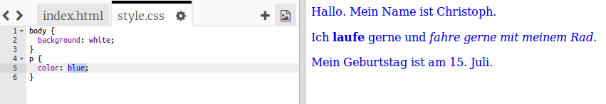

## Was ist CSS?

CSS steht für __Cascading Style Sheets__ (gestufte Gestaltungsbögen), und ist die Sprache um Web-Seiten zu gestalten und nett aussehen zu lassen. Im `<head>`-Abschnitt eines HTML-Dokuments kannst du es so mit einer CSS-Datei verlinken:


+ CSS listet alle __properties__ (Eigenschaften) eines gewissen 'tags' auf. Klicke auf den Reiter 'style.css' um das CSS für deine Web-Seite zu sehen.

	

+ Finde diesen Code:

	```
	p {
		color: black;
	}
	```

	Dieser CSS-Code hat eine Eigenschaft für Absätze, die die Schriftfarbe auf schwarz setzt.

+ Ändere das Wort 'black' im CSS zu 'blue'. Nun solltest du sehen, dass die Farbe aller Absätze auf blau geändert wird.

	
