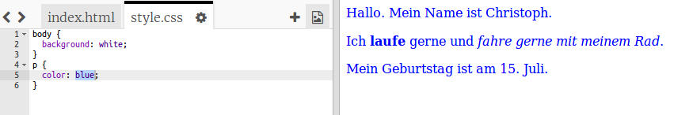

## Was ist CSS?

CSS steht für **Cascading Style Sheets**, und es ist eine Sprache, die verwendet wird, um Webseiten zu gestalten und sie nett aussehen zu lassen.

+ Dieser Code verknüpft deine Webseite mit einer CSS-Datei - sieh mal, ob du ihn im `<head>` des HTML-Dokuments finden kannst:


CSS listet alle **Eigenschaften** für ein bestimmtes Tag auf.

+ Klicke auf den Reiter `style.css`, um den CSS-Code für deine Webseite anzuzeigen.
    
    

+ Suche diesen Code:

```html
p {
    color: black;
}
```

Dieser CSS-Code bestimmt eine Eigenschaft für Absätze (`p`), die besagt, dass die Textfarbe schwarz sein soll. Beachten Sie die amerikanische Schreibweise: "color".

+ Ändere das Wort "schwarz" im CSS-Code zu "blau". Du solltest sehen, dass die Textfarbe aller Absätze blau wird.

