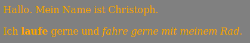

--- challenge ---

## Aufgabe: Füge weitere Stile hinzu

+ Kannst du die Texte orange (orange) machen?

+ Kannst du den Hintergrund grau (grey) machen, indem du das `body`-Tag änderst?

Und ergänze den CSS-Code in <0>style.css</0>, um das Bild zu positionieren.

--- /challenge ---