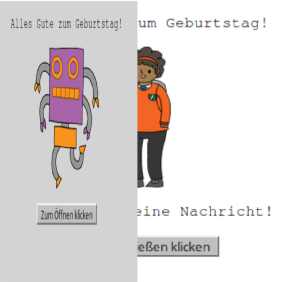
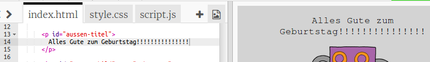
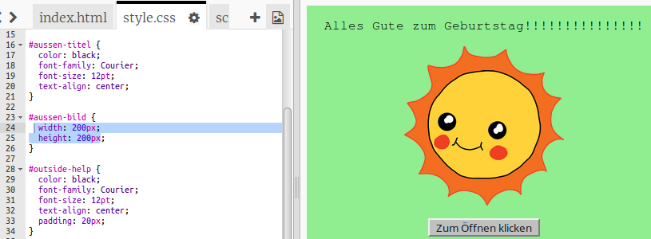
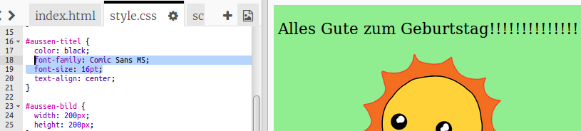

## Eine Gebutstagskarte machen

Lass uns das, was du über HTML und CSS gelernt hast verwenden um deine individuelle Geburtstagskarte zu machen.

+ Open [this trinket](http://jumpto.cc/web-card){:target="_blank"}.

+ Öffne dieses Trinket: <a href="http://jumpto.cc/web-card" target="_blank">jumpto.cc/web-card</a>, oder verwende die eingebettete Version weiter unten, falls du dies online liest.

	<iframe src="https://trinket.io/embed/html/90506676c9" width="100%" height="400" frameborder="0" marginwidth="0" marginheight="0" allowfullscreen>
	</iframe>

Mach dir keine Sorgen, falls du nicht den gesamten Code verstehst. Diese Geburtstagskarte sieht ziemlich fade aus. Du solltest einige Änderungen an diesem HTML und am CSS machen.

+ Klicke die Schaltfläche auf der Vorderseite der Karte, und sie sollte sich öffnen und die Innenseite zeigen. 

	

+ Gehe zu Zeile 13 des Codes. Wie in dem früheren Beispiel kannst du jeden Text im HTML ändern um deine Karte anzupassen.

	

+ Findest du das HTML für das Roboter-Bild? (Tipp: es ist auf Zeile 16!) Ändere das Wort `robot` zu `sun`, und du siehst, dass sich das Bild ändert!

	

	Du kannst jedes der Wörter `boy`, `diamond`, `dinosaur`, `flowers`, `girl`, `rainbow`, `robot`, `spaceship`, `sun`, `tea`, oder `trophy` probieren.

+ Du kannst auch das CSS der Geburtstagskarte ändern. Klicke auf den Reiter “style.css”. Es beginnt mit dem CSS für die `outside` (Außenseite) der Karte. Ändere die `background-color` (Hintergrundfarbe) auf `lightgreen` (hellgrün).

	

+ Du kannst auch die größe eines Bildes ändern. Gehe zu Zeile 29 des CSS, und ändere die `width` (Breite) und `height` (Höhe) des Bildes auf der Außenseite zu `200px` (`px` steht for pixels - Bilpunkte).

		

+ Die Schrift kann auch geändert werden. Gehe zu Zeile 24 und ändere die `font-family` (Schriftfamilie) zu `Comic Sans MS` und die `font-size` (Schriftgröße) zu `16pt`.

	

	Du kannst auch andere Schriften verwenden wie: arial, Impact and Tahoma. 
