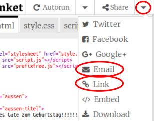

--- challenge ---
## Aufgabe: Mache eine personalisierte Karte
Verwende alles, was du über HTML und CSS gelernt hast, um deine personalisierte Karte zu vollenden. Es muss auch keine Geburtstagskarte sein, jeder beliebige Anlass ist möglich.

Hier ist ein Beispiel:

Jetzt, wo du deine Karte fertig gestellt hast, kannst du sie teilen oder per e-mail an jemanden schicken.

--- /challenge ---
