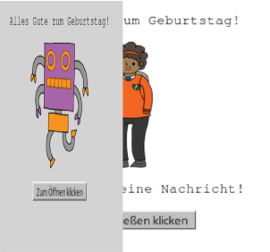
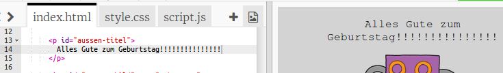
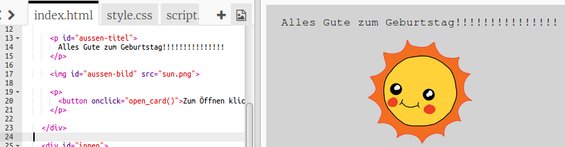
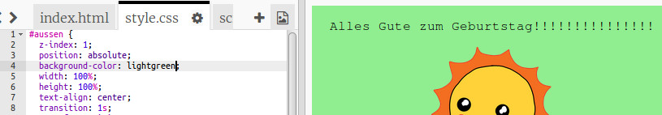
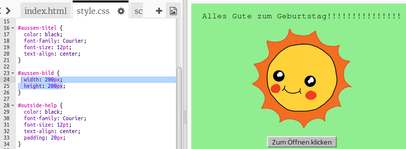
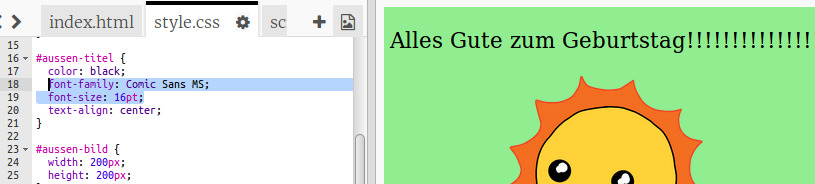

## Eine Geburtstagskarte erstellen

Lass uns das, was du über HTML und CSS gelernt hast, verwenden, um deine eigene Geburtstagskarte zu erstellen.

+ Öffne dieses [trinket](https://trinket.io/html/b33e4f4ca8){:target="_blank"}.

Um loszulegen haben wir eine Menge Code geschrieben, aber die Geburtstagskarte sieht bisher ziemlich langweilig aus, also wirst du einige Änderungen am HTML- und CSS-Code vornehmen.

+ Klicke auf die Schaltfläche auf der Vorderseite der Karte, und sie sollte sich öffnen und das Innere zeigen.

+ Gehe zu Zeile 14 des HTML-Codes. Versuche den Text zu bearbeiten, um deine Karte anzupassen.

+ Kannst du den HTML-Code für das Roboterbild finden und das Wort `robot` zu `sun` ändern?

\--- hints \--- \--- hint \---

+ Such den Code in Zeile 17.
+ Ändere das Wort `robot` zu `sun` und du wirst sehen, dass sich das Bild ändert!

\--- /hint \--- \--- /hints \---

You can use any of the words `boy`, `diamond`, `dinosaur`, `flowers`, `girl`, `rainbow`, `robot`, `spaceship`, `sun`, `tea`, or `trophy` for a birthday card, or `cracker`, `elf`, `penguin`, `present`, `reindeer`, `santa`, or `snowman` if you would prefer to make a Christmas card.

You can also edit the CSS code of the birthday card.

+ Klicke auf die Registerkarte `style.css`. Der erste Teil besteht aus allen CSS-Stilen für die **Außenseite** der Karte.

+ Ändere die `background-color` zu `lightgreen` (hellgrün).

+ Du kannst auch die Größe eines Bildes ändern. Gehe zum CSS-Code `#aussen-bild` und ändere die `width` (Breite) und die `height` (Höhe) des äußeren Bildes auf `200px` (`px` steht für pixels=Bildpunkte).

+ Auch die Schriftart kann geändert werden. Gehe zum CSS `#aussen-titel` und ändere die `font-family` auf `Comic Sans MS` und die `font-size` auf `16pt`.

You can use other fonts, for example:

+ `arial`
+ `Impact`
+ `Tahoma`