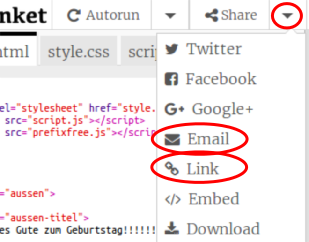

--- challenge ---

## Aufgabe: Erstelle eine personalisierte Karte

+ Verwende alles, was du über HTML und CSS gelernt hast, um eine personalisierte Karte zu erstellen. Es muss auch keine Geburtstagskarte sein, es könnte eine für Weihnachten oder für eine andere Gelegenheit sein!

Hier ist ein Beispiel:

Du findest weitere CSS-Farbnamen [hier](http://jumpto.cc/colours){:target="_blank"}.

+ Sobald du deine Karte fertiggestellt hast, kannst du sie mit jemandem teilen oder sie per E-Mail zusenden.

--- /challenge ---

***

Dieses Projekt wurde von freiwilligen Helfern übersetzt:

**Karl Schuh**

**Theresa Arendt**

**Mario Holzer**

Dank freiwilliger Helfer können wir Menschen auf der ganzen Welt die Möglichkeit geben, in ihrer eigenen Sprache zu lernen. Du kannst uns helfen, mehr Menschen zu erreichen, indem Du dich freiwillig zum Übersetzen meldest - weitere Informationen unter [rpf.io/translate](https://rpf.io/translate).
