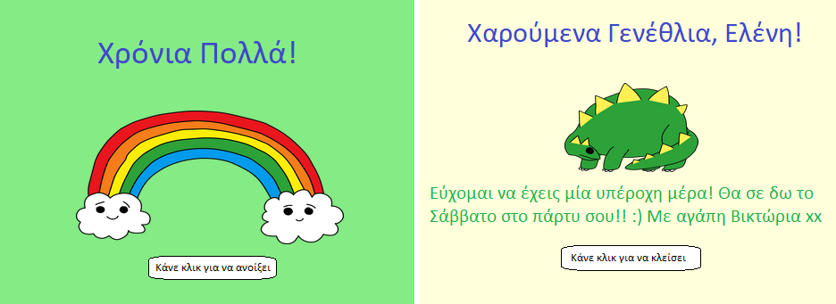

## Εισαγωγή

Σε αυτό το έργο, θα κάνεις μία εισαγωγή σε HTML και CSS μαθαίνοντας πώς να φτιάξεις τη δική σου προσαρμοσμένη κάρτα γενεθλίων.

### Τι θα φτιάξεις

Κάνε κλικ στο κουμπί για να ανοίξεις την κάρτα γενεθλίων:

  <iframe src="https://trinket.io/embed/html/c3d52cf65c?outputOnly=true&start=result" width="600" height="450" frameborder="0" marginwidth="0" marginheight="0" allowfullscreen>
  </iframe>
  

### Τι θα μάθεις

Αυτό το έργο καλύπτει στοιχεία από τις ακόλουθες πτυχές του [Raspberry Pi Digital Curriculum Making](http://rpf.io/curriculum){:target="_blank"}:

+ [Σχεδιασμός βασικών στοιχείων 2D και 3D](https://www.raspberrypi.org/curriculum/design/creator)"{:target="_blank"}.

### Πρόσθετες πληροφορίες για εκπαιδευτικούς

Αν χρειαστεί να εκτυπώσεις αυτό το έργο, χρησιμοποίησε την [εκτυπώσιμη έκδοση](https://projects.raspberrypi.org/en/projects/happy-birthday/print)"{:target="_blank"} .

Χρησιμοποίησε το σύνδεσμο στο υποσέλιδο για να αποκτήσεις πρόσβαση στο αποθετήριο GitHub για αυτό το έργο, το οποίο περιέχει όλους τους πόρους (συμπεριλαμβανομένου ενός έργου που έχει ολοκληρωθεί στο παράδειγμα) στο φάκελο 'en/resources'.