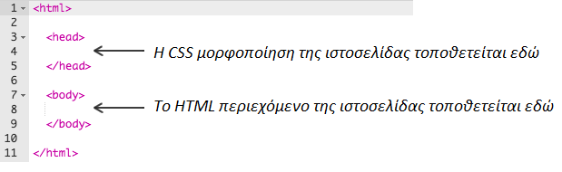
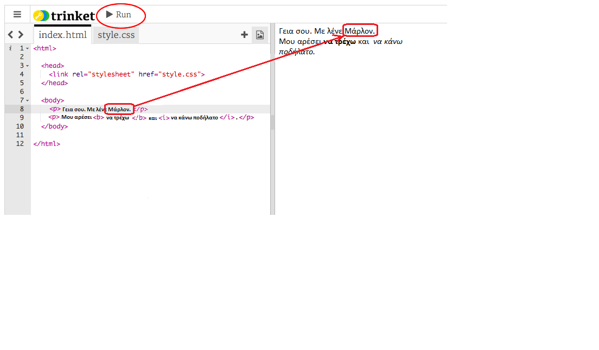
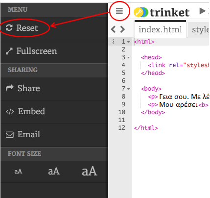
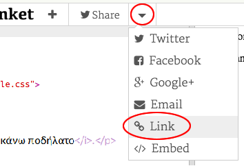
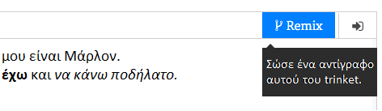

## Τι είναι η HTML;

HTML σημαίνει **Hypertext Markup Language**, δηλαδή Γλώσσα Σήμανσης Υπερκειμένου και είναι η γλώσσα που χρησιμοποιείται για την δημιουργία ιστοσελίδων. Ας δούμε ένα παράδειγμα!

Θα χρησιμοποιήσεις έναν ιστότοπο που ονομάζεται trinket.io για να γράψεις κώδικα HTML.

+ Άνοιξε [αυτό το trinket](https://trinket.io/html/18a82ca768){:target="_blank"}.

Το έργο πρέπει να μοιάζει έτσι:


Ο κώδικας στα αριστερά είναι HTML. Στα δεξιά του trinket, βλέπεις την ιστοσελίδα που έφτιαξε ο κώδικας HTML.

Η HTML χρησιμοποιεί **tags**, δηλαδή ετικέτες, για την δημιουργία ιστοσελίδων. Δες τον κώδικα HTML στη γραμμή 8:

```html
<p>Γεια σου. Ονομάζομαι Άγγελος.</p>
```

Το `<p>` είναι ένα παράδειγμα ετικέτας και προκύπτει από τη λέξη **paragraph**, δηλαδή παράγραφος. Μπορείς να ξεκινήσεις μια παράγραφο με `<p>` και να ολοκληρώσεις μια παράγραφο με `</p>`.

+ Μπορείς να βρεις άλλες ετικέτες;

--- collapse ---
---
title: Απάντηση
---
Μια άλλη ετικέτα που ίσως έχει εντοπίσει είναι η `<b>`, που σημαίνει **bold** και χρησιμοποιείται για τον έντονο τονισμό των λέξεων:

```html
<b>τρέξιμο</b>
```

Υπάρχουν μερικές ακόμη:

+ `<html>` και `</html>` επισημαίνουν την αρχή και το τέλος του κειμένου HTML
+ `<head>` και `</head>` δείχνουν την περιοχή που θα δηλωθούν πληροφορίες όπως η CSS (θα το εξηγήσουμε αυτό παρακάτω)
+ `<body>` και `</body>` δηλώνουν την περιοχή που βρίσκεται το περιεχόμενο της ιστοσελίδας σου



--- /collapse ---

+ Κάνε μια αλλαγή σε μία από τις παραγράφους του κειμένου στο αρχείο HTML (στα αριστερά). Κάνε κλικ στο **Run** και θα δεις στην ιστοσελίδα σου να αλλάζει (στα δεξιά)!



+ Αν έχεις κάνει κάποιο λάθος και θέλεις να αναιρέσεις όλες τις αλλαγές σου, μπορείς να κάνεις κλικ στο κουμπί **menu** και στη συνέχεια, κλικ στην επιλογή **Reset**.



Για να ακυρώσεις μόνο την τελευταία ενέργεια που έκανες, μπορείς να πατήσεις τα πλήκτρα `Ctrl` και `z` μαζί.

### Δεν χρειάζεσαι λογαριασμό Trinket για να αποθηκεύσεις τα έργα σου!

Εάν δεν διαθέτεις λογαριασμό Trinket, κάνε κλικ στο **κάτω** βέλος και, στη συνέχεια, κάνε κλικ στην επιλογή **Link**. Αυτό θα σου δώσει έναν σύνδεσμο που μπορείς να αποθηκεύσεις και να επιστρέψεις αργότερα. Θα πρέπει να το κάνεις αυτό κάθε φορά που κάνεις αλλαγές, καθώς ο σύνδεσμος θα αλλάζει!



Αν έχεις λογαριασμό Trinket, ο ευκολότερος τρόπος για να αποθηκεύσεις την ιστοσελίδα σου είναι να κάνεις κλικ στο κουμπί **Remix** στο πάνω μέρος του trinket. Αυτή η ενέργεια θα σώσει ένα αντίγραφο του trinket στο προφίλ σου.

