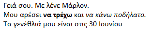

\--- challenge \---

## Πρόκληση: πρόσθεσε μια ακόμη παράγραφο

- Μπορείς να προσθέσεις μια τρίτη παράγραφο κειμένου στην ιστοσελίδα σου, κάτω από τις άλλες δύο;

Θυμήσου ότι η νέα παράγραφος πρέπει να ξεκινά με την ετικέτα `
` και να τελειώνει με την ετικέτα `
`.

Έτσι μπορεί να φαίνεται η ιστοσελίδα σου:

Μπορείς να προσθέσεις **έντονο** και <u>υπογραμμισμένο</u> κείμενο στη νέα παράγραφο; Χρησιμοποίησε ετικέτες `<u>` και `</u>` για υπογραμμισμένο κείμενο.

\--- /challenge \---