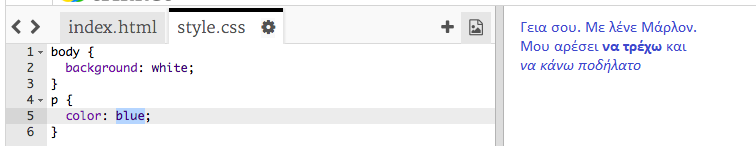

## Τι είναι η CSS

Η CSS προκύπτει από τις λέξεις **Cascading Style Sheets**, και είναι μια γλώσσα που χρησιμοποιείται για να μορφοποιήσουμε ιστοσελίδες και να τις κάνουμε ευπαρουσίαστες.

+ Αυτός ο κώδικας συνδέει την ιστοσελίδα σου με ένα αρχείο CSS - δες αν μπορείς να το βρεις στην `<head>` του εγγράφου HTML:


Η CSS παραθέτει όλες τις **ιδιότητες** για μια συγκεκριμένη ετικέτα.

+ Κάνε κλικ στην καρτέλα `style.css` για να δεις τον κώδικα CSS για την ιστοσελίδα σου.
    
    

+ Βρες αυτόν τον κώδικα:

```html
p {
    color: black;
}
```

Αυτός ο κώδικας CSS προσδιορίζει μια ιδιότητα για παραγράφους (`p`), που λέει ότι το χρώμα του κειμένου πρέπει να είναι μαύρο (black).

+ Άλλαξε τη λέξη 'black' στον κώδικα CSS σε 'blue' (μπλε). Θα πρέπει να δεις το χρώμα κειμένου όλων των παραγράφων να αλλάζει σε μπλε χρώμα.

