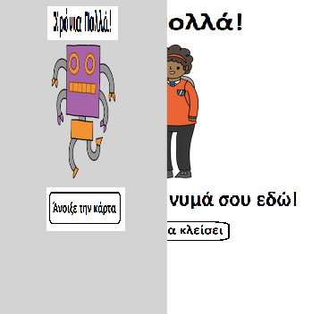
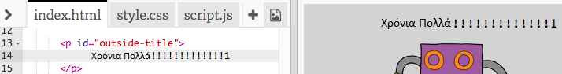
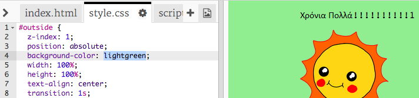
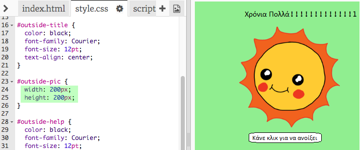
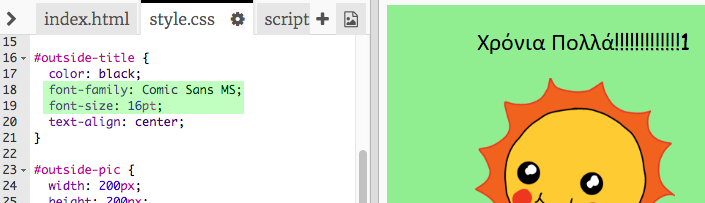

## Δημιουργία κάρτας γενεθλίων

Ας χρησιμοποιήσουμε αυτό που έχεις μάθει για την HTML και την CSS για να δημιουργήσεις τη δική σου προσαρμοσμένη κάρτα γενεθλίων.

+ Άνοιξε [αυτό το trinket](http://jumpto.cc/web-card){:target="_blank"}.

Έχουμε γράψει αρκετό κώδικα για να ξεκινήσεις, αλλά η κάρτα γενεθλίων φαίνεται αρκετά βαρετή μέχρι στιγμής, οπότε θα κάνεις κάποιες αλλαγές στον κώδικα HTML και CSS.

+ Κάνε κλικ στο κουμπί στο μπροστινό μέρος της κάρτας και θα τη δεις να ανοίγει και να αποκαλύπτει το εσωτερικό.

+ Πήγαινε στη γραμμή 14 του κώδικα HTML. Δοκίμασε να επεξεργαστείς το κείμενο για να προσαρμόσεις την κάρτα σου.

+ Μπορείς να βρείς τον κώδικα HTML για την εικόνα του ρομπότ και να αλλάξεις τη λέξη `robot` σε `sun` (ήλιος);

\--- hints \--- \--- hint \---

+ Κοίτα στη γραμμή 17 για να βρεις τον κώδικα.
+ Άλλαξε τη λέξη `robot` σε `sun`, και θα δεις την εικόνα να αλλάζει!

 \--- /hint \--- \--- /hints \---

Μπορείς να χρησιμοποιήσεις οποιαδήποτε από τις λέξεις `boy`, `diamond`, `dinosaur`, `flowers`, `girl`, `rainbow`, `robot`, `spaceship`, `sun`, `tea`, ή `trophy` για μια κάρτα γενεθλίων ή `cracker`, `elf`, `penguin`, `present`, `reindeer`, `santa`, ή `snowman` αν προτιμάς να φτιάξεις μια κάρτα Χριστουγέννων.

Μπορείς επίσης να επεξεργαστείς τον κώδικα CSS της κάρτας γενεθλίων.

+ Κάνε κλικ στην καρτέλα `style.css`. Το πρώτο μέρος είναι όλα τα στυλ CSS για το **εξωτερικό μέρος** της κάρτας.

+ Άλλαξε το `background-color` σε `lightgreen`.

+ Μπορείς επίσης να αλλάξεις το μέγεθος μιας εικόνας. Πήγαινε στον κώδικα CSS `#outside-pic` και άλλαξε τις ιδιότητες `width` (πλάτος) και `height` (ύψος) της εξωτερικής εικόνας σε `200px` (`px` σημαίνει pixel, δηλαδή τα μικρότερα κομμάτια που μπορεί να χωριστεί η οθόνη για κάποιο γραφικό).

+ Η γραμματοσειρά μπορεί επίσης να αλλάξει. Πήγαινε στο κώδικα CSS `#outside-title` και άλλαξε το `font-family` (οικογένεια γραμματοσειρών) σε `Comic Sans MS` και το `font-size` (μέγεθος γραμματοσειράς) σε `16pt`.

Μπορείς να χρησιμοποιήσεις κι άλλες γραμματοσειρές, για παράδειγμα:

+ `arial`
+ `Impact`
+ `Tahoma`