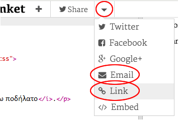

--- challenge ---

## Πρόκληση: Δημιούργησε μια εξατομικευμένη κάρτα

+ Χρησιμοποίησε ό, τι έχεις μάθει για την HTML και τη CSS για να ολοκληρώσεις τη δημιουργία μιας εξατομικευμένης κάρτας. Και δεν είναι ανάγκη να είναι μια κάρτα γενεθλίων, θα μπορούσε να είναι μία χριστουγεννιάτικη κάρτα ή για οποιαδήποτε άλλη γιορτή!

Ακολουθεί ένα παράδειγμα:

Βρες περισσότερα CSS ονόματα χρωμάτων [εδώ](http://jumpto.cc/colours){:target="_blank"}.

+ Μόλις τελειώσεις την κάρτα σου, μπορείς να την μοιραστείς ή να την στείλεις με ηλεκτρονικό ταχυδρομείο σε κάποιον.

--- /challenge ---

***

Το έργο αυτό μεταφράστηκε από τους εθελοντές:

**Μάνος Ζεάκης**

**Γιώργος Νικολαΐδης**

Χάρη στους εθελοντές, μπορούμε να δώσουμε σε ανθρώπους σε όλο τον κόσμο την ευκαιρία να μάθουν στη γλώσσα τους. Μπορείτε να μας βοηθήσετε να προσεγγίσουμε περισσότερους ανθρώπους μεταφράζοντας εθελοντικά - περισσότερες πληροφορίες στο rpf.io/translate.
