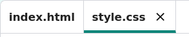

## What is CSS?

CSS stands for **Cascading Style Sheets**, and it is a language used to style webpages and make them look nice.

This code links your webpage to a CSS file — see if you can find it in the `<head>` of the HTML document:

--- code ---
---
language: html
filename: index.html
line_numbers: true
line_number_start: 3
line_highlights: 4
---
  <head>
    <link rel="stylesheet" href="style.css">
  </head>
--- /code ---

CSS lists all of the **properties** for a particular tag.

--- task ---

Click on the `style.css` file on the left to see the CSS code for your webpage.

--- /task ---

--- task ---

Find this code:

--- code ---
---
language: css
filename: style.css
line_numbers: true
line_number_start: 4
line_highlights: 
---
p {
	color: black;
}
--- /code ---

--- /task ---

This CSS code determines a property for paragraphs (`p`), which says that the text colour should be black. Notice the American spelling: 'color'.

--- task ---

Change the word 'black' in the CSS code to 'blue'. You should see the text colour of all paragraphs change to blue, when you click on **Run**.

--- code ---
---
language: css
filename: style.css.html
line_numbers: true
line_number_start: 4
line_highlights: 5
---
p {
  color: blue;  
}
--- /code ---

--- /task ---
