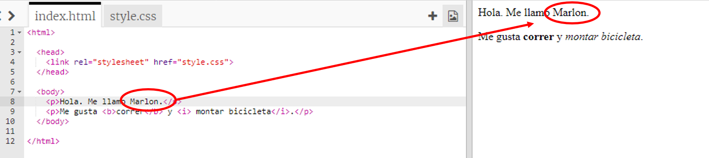

## ¿Qué es HTML?

HTML son las siglas de __HyperText Markup Language__ (Lenguaje de Marcas de Hipertexto), y es el lenguaje que se usa para crear páginas web. ¡Vamos a ver un ejemplo!

+ Tendrás que usar una página web llamada Trinket para escribir HTML. Abre este Trinket: <a href="http://jumpto.cc/web-intro" target="_blank">jumpto.cc/web-intro</a>. Si estás leyendo este proyecto online, también puedes usar la versión incrustada de Trinket que aparece a continuación:

<div class="trinket">
	<iframe src="https://trinket.io/embed/html/850a678202" width="100%" height="400" frameborder="0" marginwidth="0" marginheight="0" allowfullscreen>
	</iframe>
</div>

+ El código que aparece a la izquierda del Trinket es HTML. A la derecha, aparece la página web que se crea con el código HTML.

	HTML usa __etiquetas__ para crear páginas web. ¿Puedes ver este HTML en la línea 8 de tu código?

	```
	<p>Hi. My name is Andy.</p>
	```

	`<p>` es un ejemplo de etiqueta, y es la abreviación de __paragraph__ (párrafo). Puedes empezar un párrafo con `<p>` y acabarlo con `</p>`.

+ ¿Eres capaz de encontrar otras etiquetas? Otra etiqueta que a lo mejor has visto en la línea 9 es `<b>`, que es la abreviación de __bold__ (negrita):

	```
	<b>running</b>
	```

	Éstos son algunos ejemplos más:

	+ `<html>` y `</html>` marcan el inicio y el final del documento de HTML;
	+ `<head>` y `</head>` (cabecera) es donde se encuentran cosas como CSS (Hablaremos de esto más adelante);
	+ `<body>` y `</body>` (cuerpo) es donde se añade el contenido de la página web.

	

+ Cambia uno de los párrafos de texto en el HTML (a la izquierda). Presiona 'Run' (ejecutar) y podrás ver el cambio en la página web (a la derecha).

	

+ Si te has equivocado y quieres deshacer los cambios, puedes hacer clic en el botón de menú y seleccionar 'Reset' (Reiniciar). ¡Haz una prueba!

	

__¡No necesitas una cuenta de Trinket para guardar tus proyectos!__ 

Si no tienes una cuenta de Trinket, haz clic en la flecha hacia abajo y selecciona 'Link' (Enlace). Esto te proporcionará un enlace que puedes guardar y al que puedes volver más tarde. ¡Tendrás que hacer esto cada vez que hagas modificaciones, ya que el enlace cambia!


Si tienes una cuenta de Trinket, la forma más fácil de guardar tu página web es hacer clic en el botón 'Remix' (Remezclar) en la parte superior del Trinket. Esto guardará una copia del Trinket en tu perfil.


