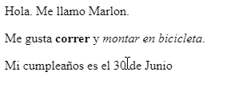

--- challenge ---
## Reto: Añade otro párrafo
¿Puedes añadir un tercer párrafo de texto a tu página web, por debajo de los otros dos? Recuerda que el nuevo párrafo tiene que empezar con una etiqueta `
`, y acabar con `
`.

Tu página web debería parecerse a ésta:

¿Puedes añadir texto __en negrita__ y <u>subrayado</u> al nuevo párrafo? Para subrayar texto, necesitarás usar `<u>` y `</u>`.

--- /challenge ---
