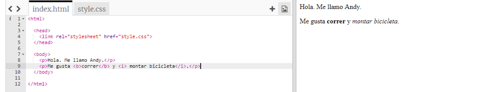
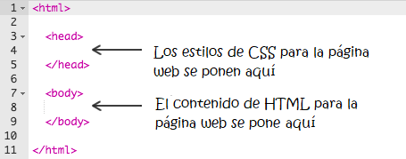
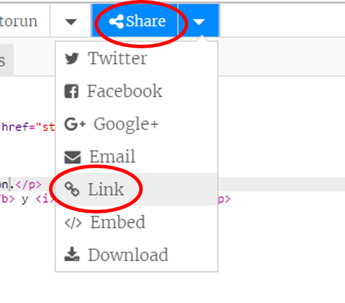
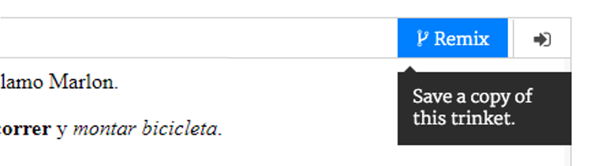

## ¿Qué es HTML?

HTML significa **Lenguaje de marcado de hipertexto**, el lenguaje que utilizan para hacer páginas web. ¡Vamos a ver un ejemplo!

Utilizarás un sitio web que se llama trinket.io para escribir el código HTML.

+ Abre [este trinket](https://trinket.io/html/397b33274a){:target="_blank"}.

El proyecto debería parecerse a esto:



El código que puedes ver a la izquierda es HTML. A la derecha del trinket, puedes ver la página web que crea el código HTML.

HTML usa **etiquetas** para construir páginas web. Busca este código HTML en la línea 8 de tu código:

```html
<p>Hola. Me llamo Andy.</p>
```

`<p>` es un ejemplo de una etiqueta, y es la abreviatura de **párrafo**. Puedes comenzar un párrafo con `<p>` y finalizar un párrafo con ` </p>`.

+ ¿Puedes encontrar algunas etiquetas más?

--- collapse ---
---
title: Respuesta
---
Otra etiqueta que quizás has encontrado es `<b>`, que significa **negrita**:

```html
<b>correr</b>
```

Estos son algunos ejemplos más:

+ `<html>` y ` </html>` marcan el inicio y el final del documento HTML
+ `<head>` y ` </head>` es donde se ponen cosas como CSS (hablarámos de eso más adelante)
+ `<body>` y ` </body>` es donde se pone el contenido de tu sitio web



--- /collapse ---

+ Haz un cambio en unos de los párrafos del texto en el archivo HTML (a la izquierda). ¡Toca **Ejecutar**, y deberías ver el cambio de tu página web (a la derecha)!


+ Si cometiste un error y quieres deshacer todos tus cambios, puedes tocar **menú** y luego toca **Restablecer**.


Para deshacer solo lo último que hiciste, puedes pulsar las teclas ` Ctrl` y ` z ` al mismo tiempo.

### ¡No necesitas una cuenta de Trinket para guardar tus proyectos!

Si no tienes una cuenta de Trinket, haz clic en la flecha **abajo** y luego haz clic en **Enlace**. Obtendrás un enlace que podrás guardar y al que podrás regresar más tarde. ¡Deberás hacer esto cada vez que realices cambios, ya que el enlace cambiará!



Si tienes una cuenta de Trinket, la forma más fácil de guardar tu página web es tocar el botón **Remix** en la parte superior del trinket. Esto guardará una copia del trinket en tu perfil.

