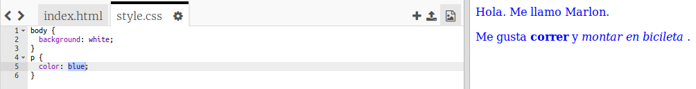

## ¿Qué es CSS?

CSS son las siglas de __Cascading Style Sheets__ (Hojas de Estilos en Cascada), y es el lenguaje que se usa para crear el estilo de las páginas web y que sean atractivas. Puedes vincular tu página web a un archivo de CSS en el apartado `<head>` de un documento HTML así:


+ CSS contiene todas las __propiedades__ para una etiqueta en concreto. Haz clic en la pestaña 'style.css' para ver el CSS de tu página web.

	

+ Encuentra este código:

	```
	p {
		color: black;
	}
	```

	Este código CSS especifica una propiedad para los párrafos, y hace que el color del texto sea negro.

+ Cambia la palabra 'black' (negro) en el CSS por 'blue' (azul). Tendrías que ver cómo cambia el color del texto de todos los párrafos a azul.

	
