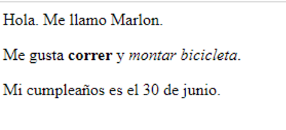

\--- challenge \---

## Desafío: añadir otro párrafo

- ¿Puedes agregar un tercer párrafo de texto a tu página web, debajo de los otros dos?

Recuerdas que tu nuevo párrafo debe comenzar con la etiqueta `
` y finalizar con ` 
`.

Así es como se ve tu página web:

¿Puedes agregar texto ** negrito ** y <u> subrayado </u> a tu nuevo párrafo? Usa las etiquetas `<u>` y ` </u>` para el texto subrayado.

\--- /challenge \---