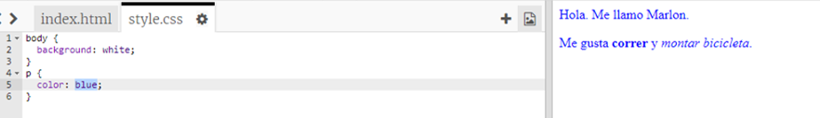

## ¿Qué es CSS?

CSS significa **Hojas de estilo en cascada**, y es un lenguaje utilizado para dar estilo a las páginas web y hacer que tengan un mejor aspecto.

+ Este código vincula tu página web a un archivo CSS; trata de encontrarlo en el `<head>` del documento HTML:


CSS enumera todas las **propiedades** para una etiqueta en particular.

+ Toca la pestaña `style.css` para ver el código CSS para tu página web.
    
    

+ Encuentra este código:

```html
p {
    color: black;
}
```

Este código CSS determina una propiedad para los párrafos (`p`), que dice que el color del texto debe ser negro. Observa la ortografía estadounidense: 'color'.

+ Cambia la palabra 'black' en el código CSS a 'blue'. Deberías ver que el color del texto de todos los párrafos cambia a azul.

