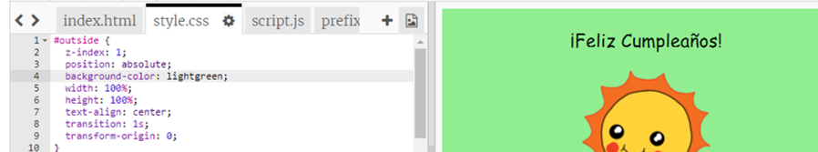

## Crear una tarjeta de cumpleaños

Vamos a usar lo que has aprendido sobre HTML y CSS para crear tu propia tarjeta de cumpleaños personalizada.

+ Abre este Trinket: <a href="http://jumpto.cc/web-card" target="_blank">jumpto.cc/web-card</a>, o usa la versión incrustada que aparece más abajo si estás leyendo este proyecto online.

	<iframe src="https://trinket.io/embed/html/90506676c9" width="100%" height="400" frameborder="0" marginwidth="0" marginheight="0" allowfullscreen>
	</iframe>

No te preocupes si no entiendes todo el código. Esta tarjeta de cumpleaños es bastante aburrida, así que vamos a hacer algunos cambios en este HTML y CSS.

+ Haz clic en el botón que hay delante de la tarjeta, y verás cómo se abre y muestra la parte interior.

	

+ Ve a la línea 13 del código. Igual que en el ejemplo anterior, puedes editar el texto en el HTML para personalizar la tarjeta.

	

+ ¿Puedes encontrar el HTML para la imagen del robot? (Pista: ¡está en la línea 16!) Cambia la palabra `robot` por `sol`, ¡y verás cambiar la imagen!

	

	Puedes usar las palabras `chico`, `diamante`, `dinosaurio`, `flores`, `chica`, `arcoíris`, `robot`, `nave`, `sol`, `té`, o `trofeo`.

+ También puedes editar el CSS de la tarjeta de cumpleaños. Presiona la pestaña “style.css”. Empieza con el CSS para el `exterior` de la tarjeta. Cambia el `background-color` (color de fondo) a `lightgreen` (verde claro).

	

+ Además, puedes cambiar el tamaño de las imágenes. Ve a la línea 29 del CSS, y cambia `width` (anchura) y `height` (altura) de la imagen exterior a `200px` (`px` significa píxeles).

		

+ Otra cosa que puedes cambiar es la fuente. Ve a la línea 24 y cambia `font-family` (tipo de fuente) a `Comic Sans MS` y `font-size` (tamaño de fuente) a `16pt`.

	

	Puedes usar otras fuentes como arial, Impact y Tahoma. 
