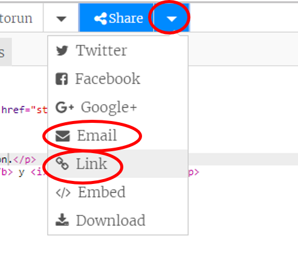

--- challenge ---
## Reto: Crea una tarjeta personalizada
Usa todo lo que has aprendido sobre HTML y CSS para acabar tu tarjeta personalizada. No tiene que ser una tarjeta de cumpleaños, ¡podría ser para cualquier ocasión!

Mira este ejemplo:

## Guarda tu proyecto {.save}

Ahora que has acabado tu tarjeta, puedes compartirla o enviársela por correo a alguien.

--- /challenge ---
