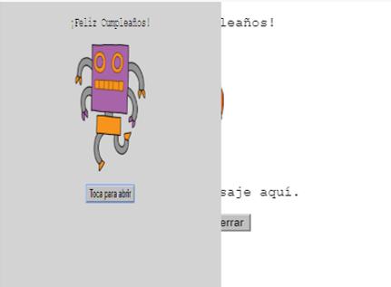
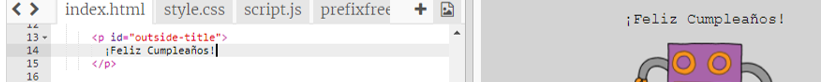
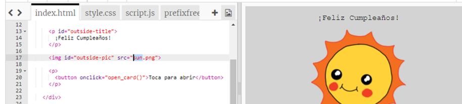
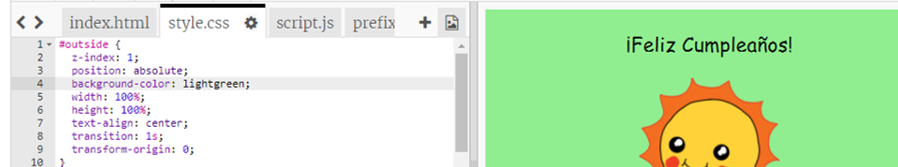
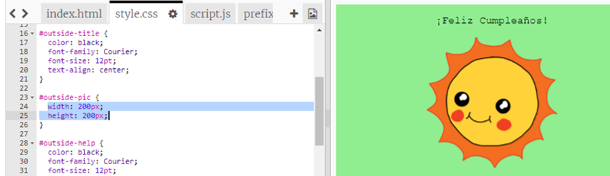
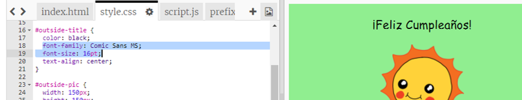

## Hacer una tarjeta de cumpleaños

Vamos a usar lo que has aprendido sobre HTML y CSS para crear tu propia tarjeta de cumpleaños personalizada.

+ Abre [este trinket](http://jumpto.cc/web-card){:target="_blank"}.

Hemos escrito un montón de código para que comiences, pero la tarjeta de cumpleaños hasta este momento parece bastante aburrida, así que vas a hacer algunos cambios en el código HTML y CSS.

+ Toca el botón de la tarjeta, y deberías ver como se abre para revelar el interior.

+ Ve a la línea 14 del código HTML. Prueba a editar el texto para personalizar tu tarjeta.

+ ¿Puedes encontrar el código HTML para la imagen del robot y cambiar la palabra `robot` a `sun`?

\--- hints \--- \--- hint \---

+ Mira en la línea 17 para encontrar el código.
+ Cambia la palabra `robot` por `sun`, y verás que la imagen cambia!

 \--- /hint \--- \--- /hints \---

Puedes user cualquieras de las palabras siguientes `boy`, `diamond`, `dinosaur`, `flowers`, `girl`, `rainbow`, `robot`, `spaceship`, `sun`, `tea`, o `trophy` para una tarjeta de cumpleaños, o `cracker`, `elf`, `penguin`, `present`, `reindeer`, `santa`, o `snowman` si prefieres hacer una tarjeta de Navidad.

También puedes editar el código CSS de la tarjeta de cumpleaños.

+ Toca la pestaña de `style.css`. La primera parte son todos los estilos CSS para el **exterior** de la tarjeta.

+ Cambia `background-color` a `lightgreen`.

+ También puedes cambiar el tamaño de la imagen. Ve al código CSS `#outside-pic` y cambia el `width` y la `height` de la imagen exterior a `200px` (`px` representa píxeles).

+ También se puede cambiar la fuente. Ve al código CSS `#outside-title` y cambia la `font-family` a `Comic Sans MS` y el `font-size` a `16pt`.

Puedes usar otras fuentes, por ejemplo:

+ `arial`
+ `Impact`
+ `Tahoma`