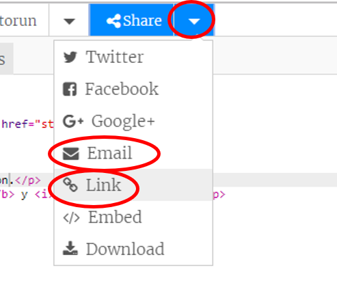

--- challenge ---

## Desafío: crea una tarjeta personalizada

+ Utiliza todo lo que has aprendido sobre HTML y CSS para terminar de crear una tarjeta personalizada. ¡Y no tiene que ser una tarjeta de cumpleaños, podría ser una para Navidad o cualquier otra ocasión!

Aquí está un ejemplo:

Puedes encontrar más nombres de colores de CSS [aquí](http://jumpto.cc/colours){:target="_blank"}.

+ Cuando has terminado tu tarjeta, puedes compartirla o enviarla por correo electrónico a alguien.

--- /challenge ---
***
### Traducción aportada por la comunidad 

Este proyecto fue traducido por **Montse Verdaguer & Jessica Clark** y revisado por **Pablo Collado**. 

Nuestros increíbles voluntarios de traducción nos ayudan a dar a los niños de todo el mundo la oportunidad de aprender a programar. Puedes ayudarnos a llegar a más niños traduciendo nuestros proyectos. Consigue más información en [rpf.io/translators](https://rpf.io/translators).
