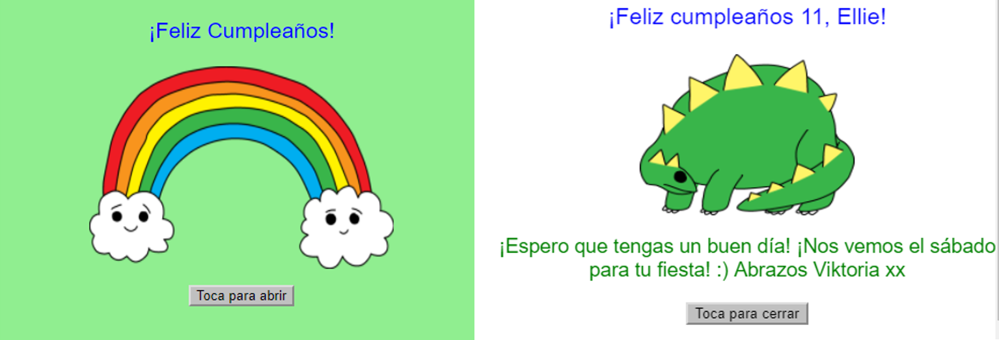

--- challenge ---

## Desafío: crea una tarjeta personalizada

+ Utiliza todo lo que has aprendido sobre HTML y CSS para terminar de crear una tarjeta personalizada. ¡Y no tiene que ser una tarjeta de cumpleaños, podría ser una para Navidad o cualquier otra ocasión!

Aquí está un ejemplo:

Puedes encontrar más nombres de colores de CSS [aquí](http://jumpto.cc/colours){:target="_blank"}.

+ Cuando hayas terminado tu tarjeta, puedes compartirla o enviarla por correo electrónico a alguien.

--- /challenge ---

***

Este proyecto fue traducido por voluntarios:

Jessica Clark
Pablo Collado
Sara Conde

Gracias a los voluntarios, podemos dar a las personas de todo el mundo la oportunidad de aprender en su propio idioma. Puede ayudarnos a llegar a más personas ofreciéndose como voluntario para traducir; más información en [rpf.io/translate](https://rpf.io/translate).
