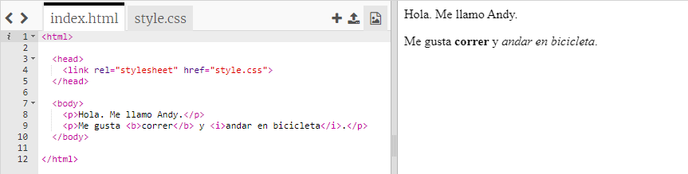
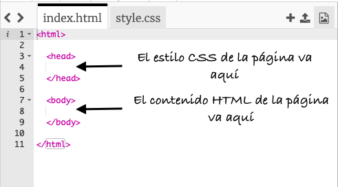
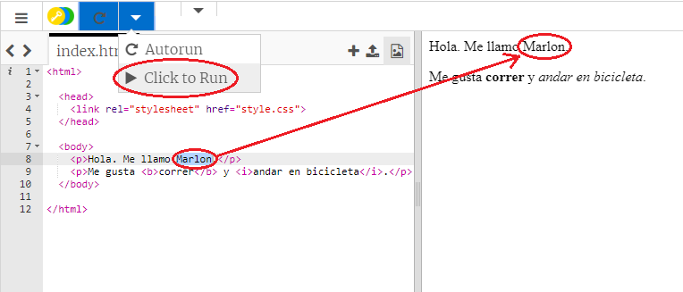
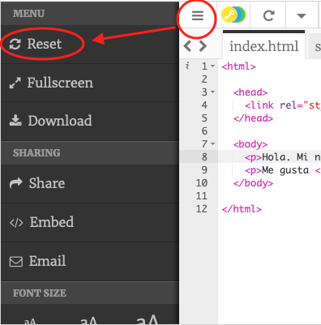
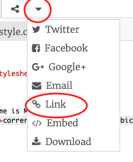
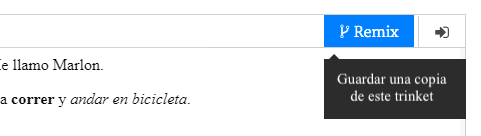

## ¿Qué es HTML?

HTML significa **Lenguaje de marcado de hipertexto**, el lenguaje que se utiliza para hacer páginas web. ¡Veamos un ejemplo!

Utilizarás un sitio web que se llama trinket.io para escribir el código HTML.

+ Abre [este trinket](http://jumpto.cc/web-intro){:target="_blank"}.

El proyecto deberá parecerse a esto:



El código que puedes ver a la izquierda es HTML. A la derecha del trinket, puedes ver la página web que ha creado el código HTML.

HTML usa **etiquetas** para construir páginas web. Busca este código HTML en la línea 8 de tu código:

```html
<p>Hola. Me llamo Andy.</p>
```

`<p>` is an example of a tag, and is short for **paragraph**. You can start a paragraph with `<p>`, and end a paragraph with `</p>`.

+ ¿Puedes encontrar otras etiquetas?

## \--- collapse \---

## title: Respuesta

Otra etiqueta que quizás has encontrado es `<b>`, que significa **negrita**:

```html
<b>correr</b>
```

Aquí tienes otros ejemplos:

+ `<html>` y ` </html>` marcan el inicio y el final del documento HTML
+ `<head>` y ` </head>` es donde se ponen cosas como CSS (hablaremos de eso más adelante)
+ `<body>` y ` </body>` es donde se pone el contenido de tu sitio web



\--- /collapse \---

+ Haz un cambio en uno de los párrafos del texto en el archivo HTML (a la izquierda). ¡Haz clic en **Ejecutar** y deberías ver el cambio de tu página web (a la derecha)!



+ Si cometiste un error y quieres deshacer todos tus cambios, puedes hacer clic en el **menú** y luego haz clic en **Restablecer**.



Para deshacer solo lo último que hiciste, puedes pulsar las teclas `Ctrl` y `z` al mismo tiempo.

### ¡No necesitas una cuenta de Trinket para guardar tus proyectos!

Si no tienes una cuenta de Trinket, haz clic en la flecha **abajo** y luego haz clic en **Enlace**. Obtendrás un enlace que podrás guardar y al que podrás regresar más tarde. ¡Deberás hacer esto cada vez que hagas cambios, ya que el enlace cambiará!



Si tienes una cuenta de Trinket, la forma más fácil de guardar tu página web es hacer clic en el botón **Remix** en la parte superior del trinket. Esto guardará una copia del trinket en tu perfil.

