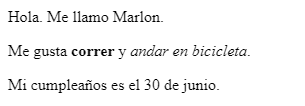

\--- challenge \---

## Desafío: añade otro párrafo

- ¿Puedes agregar un tercer párrafo de texto a tu página web, debajo de los otros dos?

Recuerda que tu nuevo párrafo debe comenzar con la etiqueta `
` y finalizar con la etiqueta `
`.

Así se podría ver tu página web:

¿Puedes agregar texto en **negrita** y <u>subrayado</u> a tu nuevo párrafo? Usa las etiquetas `<u>` y `</u>` para texto subrayado.

\--- /challenge \---