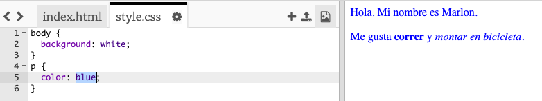

## ¿Qué es CSS?

CSS significa **Hojas de estilo en cascada**, es un lenguaje utilizado para dar estilo a las páginas web y hacer que tengan un mejor aspecto.

+ Este código vincula tu página web a un archivo CSS; trata de encontrarlo en el `<head>` del documento HTML:


CSS enumera todas las **propiedades** para una etiqueta en particular.

+ Haz clic en la pestaña `style.css` para ver el código CSS para tu página web.
    
    

+ Encuentra este código:

```html
p {
    color: black;
}
```

Este código CSS determina la propiedad para los párrafos (`p`), que dice que el color del texto debe ser negro.

+ Change the word 'black' in the CSS code to 'blue'. You should see the text colour of all paragraphs change to blue.

