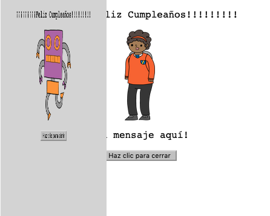
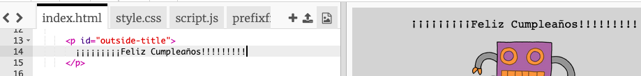
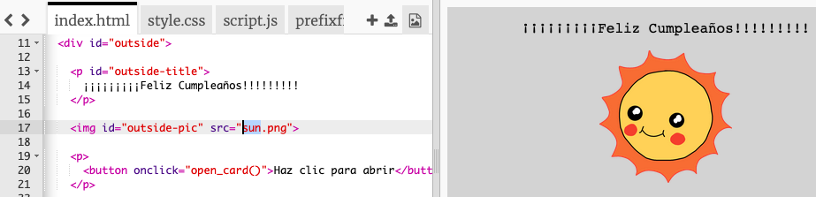
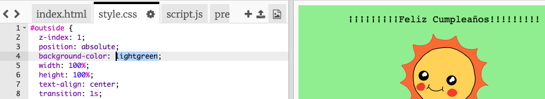
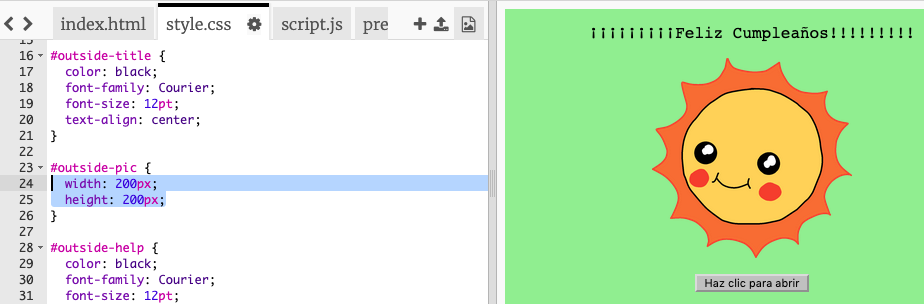
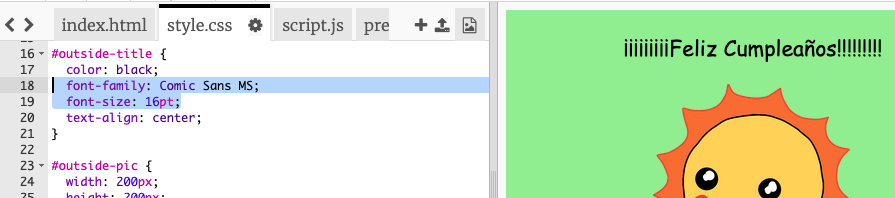

## Crear una tarjeta de cumpleaños

Vamos a usar lo que has aprendido sobre HTML y CSS para crear tu propia tarjeta de cumpleaños personalizada.

+ Abre [este trinket](https://trinket.io/html/b33e4f4ca8){:target="_blank"}.

Hemos escrito muchos códigos para que comiences, hasta ahora la tarjeta de cumpleaños se ve bastante aburrida, así que vas a hacer algunos cambios en el código HTML y CSS.

+ Haz clic en el botón de la parte frontal de la tarjeta, deberías notar que se abre para ver el interior.

+ Ve a la línea 14 del código HTML. Prueba editar el texto para personalizar tu tarjeta.

+ ¿Puedes encontrar el código HTML para la imagen del robot y cambiar la palabra `robot` por `sun`?

\--- hints \--- \--- hint \---

+ Mira en la línea 17 para encontrar el código.
+ Change the word `robot` to `sun`, and you'll see the image change!

\--- /hint \--- \--- /hints \---

You can use any of the words `boy`, `diamond`, `dinosaur`, `flowers`, `girl`, `rainbow`, `robot`, `spaceship`, `sun`, `tea`, or `trophy` for a birthday card, or `cracker`, `elf`, `penguin`, `present`, `reindeer`, `santa`, or `snowman` if you would prefer to make a Christmas card.

You can also edit the CSS code of the birthday card.

+ Click on the tab for `style.css`. The first part is all of the CSS styles for the **outside** of the card.

+ Change the `background-color` to `lightgreen`.

+ You can also change the size of an image. Go to the `#outside-pic` CSS code, and change the `width` and `height` of the outside image to `200px` (`px` stands for pixels).

+ The font can be changed too. Go to the `#outside-title` CSS and change the `font-family` to `Comic Sans MS` and the `font-size` to `16pt`.

You can use other fonts, for example:

+ `arial`
+ `Impact`
+ `Tahoma`