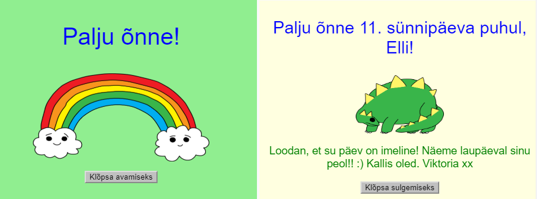

## Sissejuhatus

Selles projektis tutvustatakse sulle omaenda isikupärase sünnipäevakaardi valmistamise õpetamise kaudu HTML-i ja CSS-i.

### Mida sa teed

Sünnipäevakaardi avamiseks klõpsa nupul:

  <iframe src="https://trinket.io/embed/html/e996dc0380?outputOnly=true&start=result" width="600" height="450" frameborder="0" marginwidth="0" marginheight="0" allowfullscreen>
  </iframe>
  

### Mida sa õpid

Selles projektis käsitletakse [Raspberry Pi digitaalse tegemise õppekava](http://rpf.io/curriculum){:target="_blank"} järgmisi valdkondi:

+ [Disaini põhilisi 2D- ja 3D-varasid](https://www.raspberrypi.org/curriculum/design/creator){: target="_blank"}.

### Lisainfo õpetajatele

Kui teil on vaja see projekt välja printida, siis kasutage [printerisõbralikku versiooni](https://projects.raspberrypi.org/en/projects/happy-birthday/print){:target="_blank"}.

Kasutage linki jaluses, et pääseda ligi selle projekti GitHub varamule, mis sisaldab kõiki ressursse (kaasa arvatud valmisprojekti näidist) 'est/resources' kaustas.