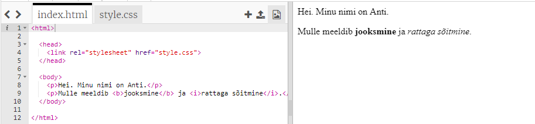
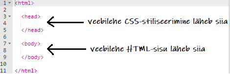
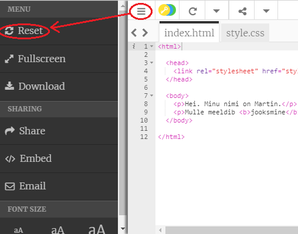
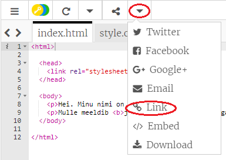
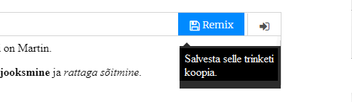

## Mis on HTML?

HTML tähistab **hüperteksti märgistuskeelt**, veebilehtede loomiseks kasutatavat keelt. Vaatame näidet!

HTML-koodi kirjutamiseks hakkad kasutama veebisaiti trinket.io.

+ Ava [see trinket](http://jumpto.cc/web-intro){:target ="_blank"}.

Projekt peaks välja nägema selline:



Kood, mida näed vasakul, on HTML. Trinkletist paremal näed HTML-koodi tehtud veebisaiti.

HTML kasutab veebisaitide loomiseks **silte**. Otsi seda HTML-koodi oma koodi 8. realt:

```html
<p>Hei. Minu nimi on Andy.</p>
```

`<p>` on sildi näidis ja see on **lõigu** lühend. Sinu lõigu alguses võib olla `<p>` ja lõpus `</p>`.

+ Kas märkad muid silte?

## \--- collapse \---

## title: Vastus

Võimalik, et üks teine sinu poolt märgatud silt on `<b>`, mis tähistab **paksu**:

```html
<b>käivitamine</b>
```

Siin on veel mõned:

+ `<html>` ja `</html>` märgib HTML-dokumendi algust ja lõppu
+ `<head>` ja `</head>` on koht, kuhu lähevad CSS-i laadsed keeled (jõuame selleni hiljem)
+ `<body>` ja `</body>` on koht, kuhu läheb sinu veebisaidi sisu



\--- /collapse \---

+ Muuda HTML-faili teksti mõnda lõiku (vasakul). Klõpsa nupul **Käivita**ja peaksid nägema oma veebilehe muutumist (paremal)!


+ Kui oled teinud vea ja soovid kõik muudatused tühistada, võid klõpsata nupul **menüü** ja seejärel nupul **Lähtesta**.



Viimasena tehtu tühistamiseks võid koos vajutada `Ctrl` ja `z` klahve.

### Sinu projektide salvestamiseks ei ole vaja Trinketi kontot!

Kui sul pole Trinketi kontot, klõpsa noolel **alla** ja seejärel **Lingil**. See annab sulle lingi, mille saad salvestada ja hiljem selle juurde tagasi tulla. Pead seda tegema iga kord, kui teed muudatusi, kuna link muutub!



Kui sul on Trinketi konto, on lihtsaim variant veebisait salvestada trinketi ülaosas oleval nupul **Remix** klõpsamine. See salvestab trinketi koopia sinu profiilil.

