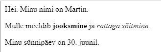

--- challenge ---

## Väljakutse: lisa veel üks ​​lõik

- Kas oskad lisada oma veebilehele kahe tekstilõigu alla kolmanda?

Pea meeles, et sinu uus lõik peaks algama sildiga `
` ja lõppema sildiga `
`.

Siin on näha, kuidas sinu veebileht välja võib näha:

Kas saad lisada oma uuele lõigule **rasvase** ja <u>allajoonitud</u> teksti? Allajoonitud teksti jaoks kasuta silte `<u>` ja `</u>`.

--- /challenge ---